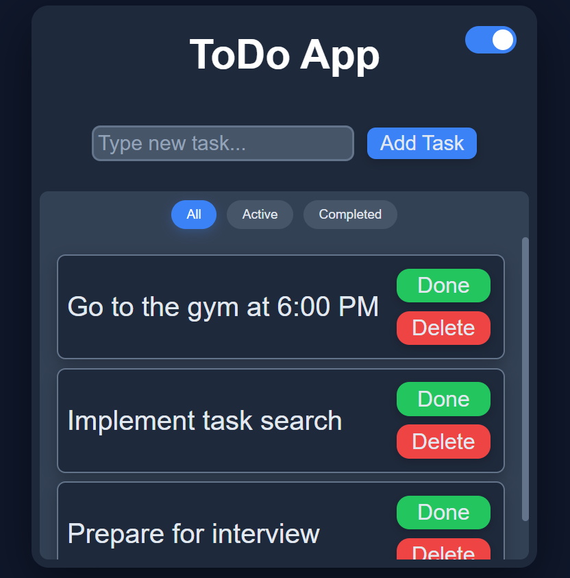
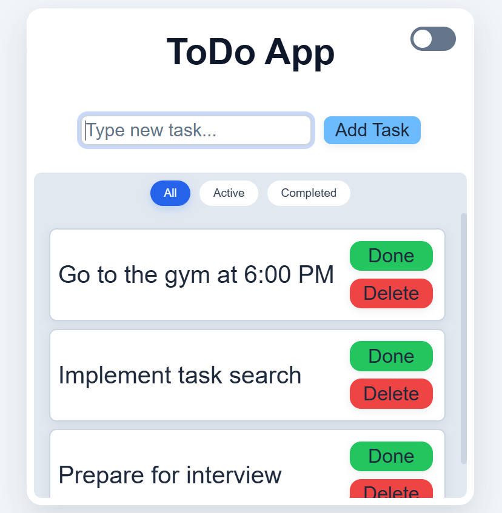

# 📝 React To-Do App


A modern and responsive **To-Do List application** built with **React**. It allows users to manage their daily tasks efficiently with features like inline editing, task filtering, local storage persistence, task completion, deletion, dark/light theme switching, keyboard shortcuts, and a clean, intuitive user interface.

---

## ✨ Features

* ➕ Add new tasks
* ✏️ Edit tasks by double-clicking
* ✅ Mark tasks as completed
* 🗑️ Delete tasks
* 🔍 Filter tasks (All / Active / Completed)
* 💾 Automatically save tasks using Local Storage
* 🌙 Remember selected theme after page refresh
* 🌙 Toggle between Dark and Light themes
* 🎨 Elegant UI with smooth animations
* 📱 Responsive design
* ⌨️ Keyboard shortcuts
  * **Enter** → Add/Save task
  * **Escape** → Cancel editing
* 🎯 Clean and beginner-friendly React code

---

## 📸 Screenshots

<table align="center">
<tr>
<td align="center" width="50%">



**🌙 Dark Theme**

</td>

<td align="center" width="50%">



**☀️ Light Theme**

</td>
</tr>
</table>

---

## 🚀 Live Demo

👉 **[Open React To-Do App](https://react-todo-yash.vercel.app)**

---

## 🛠️ Built With

* ⚛️ React
* JavaScript (ES6+)
* HTML5
* CSS3
* CSS Variables
* React Hooks
* Browser Local Storage API
* Vite

---

## 📂 Project Structure

```
react-todo-app/
│
├── public/
├── screenshots/
│   ├── screenshot-dark.png
│   └── screenshot-light.png
│
├── src/
│   ├── ToDoList.jsx
│   ├── index.css
│   ├── main.jsx
│   └── App.jsx
│
├── package.json
├── vite.config.js
└── README.md
```

---

## 🎯 How It Works

### Adding a Task

* Type a task into the input field.
* Press **Enter** or click **Add Task**.
* The task is added to the list instantly.

---

### Editing a Task

* Double-click on any incomplete task.
* Modify the text.
* Press **Enter** or click outside the input to save.
* Press **Escape** to cancel editing.

---

### Completing a Task

Click the **Done** button to mark a task as completed.

Completed tasks:

* display a line-through effect
* cannot be edited
* only show the Delete button

---

### Deleting a Task

Click the **Delete** button to permanently remove a task.

---

### Theme Switching

Use the toggle switch in the top-right corner to switch between:

* 🌙 Dark Mode
* ☀️ Light Mode

The UI updates instantly using CSS Variables.

---

### Task Filtering

Use the filter buttons above the task list to quickly switch between:

* 📋 All Tasks
* 🟢 Active Tasks
* ✅ Completed Tasks

The task list updates instantly without reloading the page.

---

### Local Storage

Tasks are automatically saved in your browser using **Local Storage**.

This means:

* Refreshing the page does not remove your tasks.
* Your selected theme is also remembered.
* No login or backend is required.

---

## 💡 React Concepts Used

This project demonstrates:

* Functional Components
* React Hooks
* `useState`
* `useEffect`
* Controlled Inputs
* Conditional Rendering
* Event Handling
* Dynamic Rendering using `.map()`
* Array Filtering using `.filter()`
* Browser Local Storage API
* CSS Variables
* Responsive Layout

---

## ⌨️ Keyboard Shortcuts

| Key    | Action                      |
| ------ | --------------------------- |
| Enter  | Add a new task / Save edits |
| Escape | Cancel editing              |

---

## 🎨 UI Highlights

* Modern minimal interface
* Rounded cards
* Smooth hover animations
* Button press effects
* Custom scrollbar
* Dark & Light themes
* Responsive layout
* Theme persistence
* Sticky filter tabs
* Scrollable task list
* Elegant typography using **Poppins**

---

## ⚙️ Installation

Clone the repository:

```bash
git clone https://github.com/codewithyashsoni/react-todo-app.git
```

Move into the project directory:

```bash
cd react-todo-app
```

Install dependencies:

```bash
npm install
```

Run the development server:

```bash
npm run dev
```

Open your browser and visit:

```
http://localhost:5173
```

---

## 🔮 Future Improvements

* 📌 Task priority
* 📅 Due dates
* 🔍 Search tasks
* 🏷️ Categories
* ⬆️⬇️ Drag & Drop task reordering
* ☁️ Cloud synchronization
* 📊 Task statistics
* 🔔 Notifications & reminders

---

## 🤝 Contributing

Contributions are welcome.

If you'd like to improve this project:

1. Fork the repository.
2. Create a new feature branch.
3. Commit your changes.
4. Open a Pull Request.

---

## 📄 License

This project is licensed under the MIT License. See the LICENSE file for details.

---

## 👨‍💻 Author

**Yash Soni**

GitHub: https://github.com/codewithyashsoni

---

⭐ If you found this project useful, consider giving it a star on GitHub!
